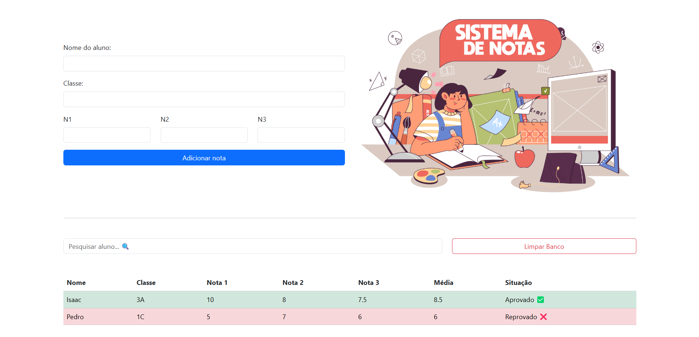

<h1>Sistema de Notas Escolares</h1>

Confira em: <a href="https://regisazevedoo.github.io/Sistema-de-Notas/" target="_blank">regisazevedoo.github.io/Sistema-de-Notas/</a>

Aplicação web desenvolvida em React para cadastro e gerenciamento de notas de alunos.
O sistema permite adicionar alunos, calcular automaticamente a média final e exibir a situação (Aprovado ou Reprovado), além de persistir os dados no navegador utilizando localStorage.

<h2>🚀 Funcionalidades</h2>

✅ Cadastro de aluno (nome e classe)

✅ Inserção de 3 notas por aluno

✅ Validação de notas (valores entre 0 e 10)

✅ Cálculo automático da média

✅ Exibição da situação:

Aprovado (média ≥ 7)

Reprovado (média < 7)

✅ Persistência automática com localStorage

✅ Exclusão completa do histórico de alunos

 
<h2>🛠️ Tecnologias Utilizadas</h2>

React (Hooks: useState, useEffect)

JavaScript (ES6+)

Bootstrap

HTML5

CSS3

localStorage API

 
<h2>🚀 Próximas Melhorias</h2>

✏️ Permitir edição de notas após cadastro

🗑️ Remoção individual de alunos

🎨 Melhorias no layout e refinamento visual da interface

 
<h2>🎯 Objetivo do Projeto</h2>

Projeto desenvolvido com foco na consolidação de fundamentos em React, especialmente:

Componentização

Gerenciamento de estado

Persistência de dados no navegador

Organização e clareza de código

Evolução contínua da aplicação